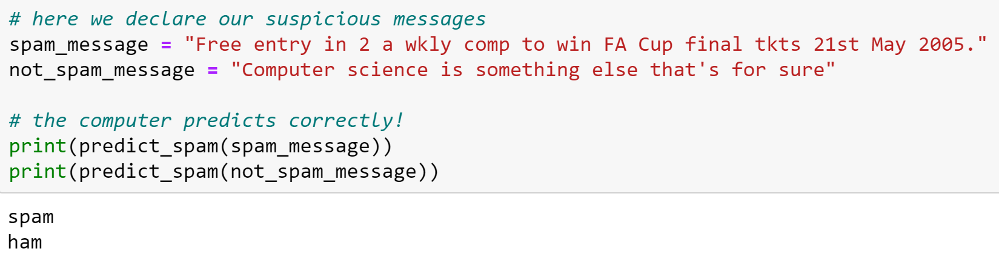
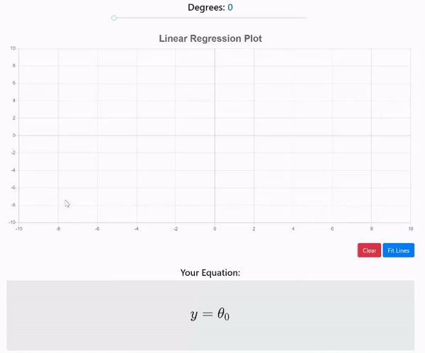
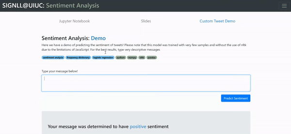
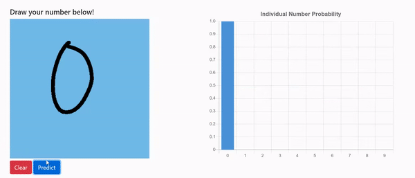
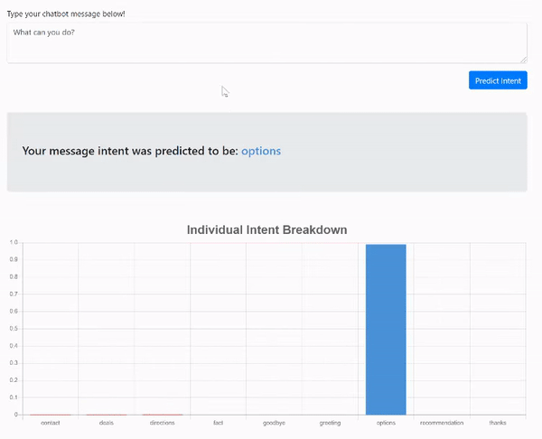
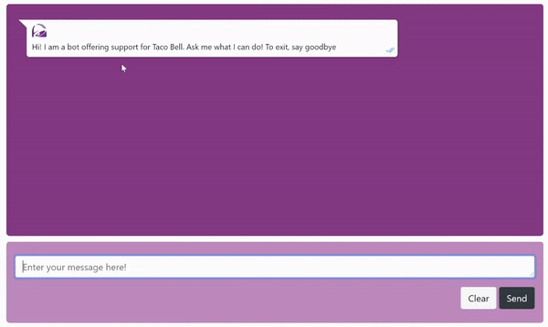

# Special Interest Group for Natural Language Learning (SIGNLL) Projects

**To learn more about SIGNLL and see the projects for yourself, visit our website [here](https://nbalepur.github.io/SIGNLL-Fall-2020/)**

SIGNLL is an organization committed to the learning and exploration of various Natural Language Processing and Machine Learning Topics. As one of the many subcommittees of the UIUC chapter of [ACM](acm.illinois.edu), we taught various lessons and walked through different Python projects to give a taste of this subfield of computer science. This repository contains the code and different materials for the Fall 2020 semester of SIGNLL

<br />
<br />

## Getting Started

To get the different projecs running on your machine, follow the steps below

### Installing and Opening Notebooks

First, run the following command to get the files on your machine

```
git clone https://github.com/nbalepur/SIGNLL-Fall-2020.git
```

The recommended IDE for these projects is `Jupyter Notebook`. My preferred installation method of `Jupyter Notebook` is with `Anaconda`

Instructions on how to install `Anaconda` can be found [here](https://docs.anaconda.com/anaconda/install/)

Once `Anaconda` is installed, simply open up the application and type `"jupyter notebook"` into the terminal. From there, you should be able to navigate to your desired project file

### Additional Installations

Some projects require additional libraries to be installed, such as `Keras` and `Tensorflow` in the `Neural Networks` project

This can be accomplished fairly simply using `Anaconda Navigator`, instructions of which can be found [here](https://www.freecodecamp.org/news/install-tensorflow-and-keras-using-anaconda-navigator-without-command-line/)

### Running Jupyter Notebooks

An in-depth tutorial on how to run and navigate through `Jupyter Notebooks` can be found [here](https://www.dataquest.io/blog/jupyter-notebook-tutorial/)

<br />
<br />

## Projects

Below you can find the different projects for SIGNLL:

### Intro to Python and NumPy

This week, we go through a brief description of NLP and the other projects we covered throughout the semester. We then showcase a notebook demo with a beginner's application to `Python` and `NumPy` We have also provided a notebook for extra practice with various `NumPy` functions and `Python` data structures. Finally, we give a brief demo of using what we've learned in a simple spam-detection model

- [Notebook Demo](./Intro%20Meeting/Meeting%201%20Slides.ipynb)
- [Slides](./Intro%20Meeting/Intro%20Meeting%20Slides.pdf)
- [Notebook Practice (Blank)](./Intro%20Meeting/Meeting%201%20Workbook%20Blank.ipynb)
- [Notebook Practice (Filled)](./Intro%20Meeting/Meeting%201%20Workbook%20Solutions.ipynb)

#### Spam / Not Spam Demo

In this introductory demo, we take a look at how we can use the basics of `Python` to predict whether or not an email is spam or not spam

*In the following screenshot, `spam` designates a spam email and `ham` is a non-spam email*



<br />

### Linear and Logistic Regression

This week, we discuss two of the most fundamental algorithms for NLP: linear and logistic regression. We give an overview of the theory behind the regression, an explanation of data collection and model validation, and a preview of how these algorithms can be applied using tweet predictions

- [Slides](./Linear%20and%20Logistic%20Regression/Linear%20and%20Logistic%20Regression%20Slides.pdf)
- [Notebook (Blank)](./Linear%20and%20Logistic%20Regression/Linear%20and%20Logistic%20Regression%20Blank.ipynb)
- [Notebook (Filled)](./Linear%20and%20Logistic%20Regression/Linear%20and%20Logistic%20Regression%20Filled.ipynb)

#### Linear Regression Demo

If you navigate to the [SIGNLL Website](nbalepur.github.io/SIGNLL-Fall-2020) under `Linear and Logistic Regression` and `Linear Regression Demo`, you can try the following demo for yourself!

You will be taken to an interactive plot where you can add points by clicking on the plot, and delete an existing point by clicking on it. Once you are satisfied, you can press `Fit Line` to run the algorithm. Finally, you can vary the degree of the model fit and the equation for the line will update dynamically. Pressing `Clear` will remove all points, lines, and equations on the screen



<br />

### Twitter Sentiment Analysis

This week, we take what we learned last week and apply logistic regression to predicting the sentiment of tweets. We'll discuss our general algorithm for sentiment analysis and apply this algorithm in the notebook to determine whether a tweet is positive or negative

- [Slides](./Twitter%20Sentiment%20Analysis/Sentiment%20Analysis%20Slides.pdf)
- [Notebook (Blank)](./Twitter%20Sentiment%20Analysis/Twitter%20Sentiment%20Analysis%20Blank.ipynb)
- [Notebook (Filled)](./Twitter%20Sentiment%20Analysis/Twitter%20Sentiment%20Analysis%20Filled.ipynb)

#### Custom Tweet Demo

If you navigate to the [SIGNLL Website](nbalepur.github.io/SIGNLL-Fall-2020) under `Sentiment Analysis` and `Custom Tweet Demo`, you can try the following demo for yourself!

In this demo, you can type in your own custom tweet and watch the computer predict whether or not your tweet was positive or negative. You'll be able to view your custom tweet, followed by visualizations of its overall sentiment probability and individual word breakdown



<br />

### Neural Networks

This week, we go over another funademental concept for NLP: neural networks. We begin by taking a look at the mathematical and statistical theory behind neural networks and the principles of training and testing. Afterwards, we create a neural network from scratch using `NumPy` and use it to predict truth tables and handwritten digits with the [MNIST](https://en.wikipedia.org/wiki/MNIST_database) dataset

**Note: To run this project in Python, you must have `Keras` installed. Instructions on how to do this can be found above**

- [Slides](./Neural%20Networks/Neural%20Network%20Slides.pdf)
- [Notebook (Blank)](./Neural%20Networks/Neural%20Networks%20Blank.ipynb)
- [Notebook (Filled)](./Neural%20Networks/Neural%20Networks%20Filled.ipynb)

#### Handwritten Digits Demo

If you navigate to the [SIGNLL Website](nbalepur.github.io/SIGNLL-Fall-2020) under `Neural Networks` and `Handwritten Digits Demo`, you can try the following demo for yourself!

Simply draw your number on the canvas and press `Predict` to view the probability distribution of the model. You can also press `Clear` to clear your drawing and predict again



<br />

### Chatbot Part 1

We begin our exploration of chatbots this week by learning what chatbots are used for, the intuition behind how they work, and a simple bag-of-words algorithm we can use to accomplish our task. Afterwards, we use our knowledge of neural networks to train a customer support chatbot to predict a certain tag depending on the user input

**Note: There are two versions of this notebook: one that uses `NumPy` and one that uses `Keras`, but they function in the exact same way**

- [Slides](./Customer%20Support%20Chatbot/Part%201/Chatbot%20Part%201%20Slides.pdf)
- [NumPy Notebook (Blank)](./Customer%20Support%20Chatbot/Part%201/%5Bnumpy%5D%5BPart%201%5D%20Customer%20Support%20Chatbot%20Blank.ipynb)
- [NumPy Notebook (Filled)](./Customer%20Support%20Chatbot/Part%201/%5Bnumpy%5D%5BPart%201%5D%20Customer%20Support%20Chatbot%20Filled.ipynb)
- [Keras Notebook (Blank)](./Customer%20Support%20Chatbot/Part%201/%5BKeras%5D%5BPart%201%5D%20Customer%20Support%20Chatbot%20Blank.ipynb)
- [Keras Notebook (Filled)](./Customer%20Support%20Chatbot/Part%201/%5BKeras%5D%5BPart%201%5D%20Customer%20Support%20Chatbot%20Filled.ipynb)

#### Tag Prediction Demo

If you navigate to the [SIGNLL Website](nbalepur.github.io/SIGNLL-Fall-2020) under `Chatbot Part 1` and `Tag Prediction Demo`, you can try the following demo for yourself!

Type a custom message and you will be able to see the chatbot's association with your message to one of the following tags:

- `contact`
- `deals`
- `directions`
- `fact`
- `goodbye`
- `greeting`
- `options`
- `recommendation`
- `thanks`



<br />

### Chatbot Part 2

This week, we review our chatbot algorithm, learn how we can make multi-class predictions, and analyze the output layer of an activated neural network. We'll then use what we learned this week and last week to use our pre-trained chatbot to make predictions and converse with a user

**Note: There are two versions of this notebook: one that uses `NumPy` and one that uses `Keras`, but they function in the exact same way**

- [Slides](./Customer%20Support%20Chatbot/Part%202/Chatbot%20Part%202%20Slides.pdf)
- [NumPy Notebook (Blank)](./Customer%20Support%20Chatbot/Part%202/%5Bnumpy%5D%5BPart%202%5D%20Customer%20Support%20Chatbot%20Blank.ipynb)
- [NumPy Notebook (Filled)](./Customer%20Support%20Chatbot/Part%202/%5Bnumpy%5D%5BPart%202%5D%20Customer%20Support%20Chatbot%20Filled.ipynb)
- [Keras Notebook (Blank)](./Customer%20Support%20Chatbot/Part%202/%5BKeras%5D%5BPart%202%5D%20Customer%20Support%20Chatbot%20Blank.ipynb)
- [Keras Notebook (Filled)](./Customer%20Support%20Chatbot/Part%202/%5BKeras%5D%5BPart%202%5D%20Customer%20Support%20Chatbot%20Filled.ipynb)

#### Chatbot Demo

If you navigate to the [SIGNLL Website](nbalepur.github.io/SIGNLL-Fall-2020) under `Chatbot Part 2` and `Chatbot Demo`, you can try the following demo for yourself!

In this demo, you'll be able to interact with the chatbot that we built. This chatbot was created to be a customer support chatbot for Taco Bell. Type the message in the input field and press `Send` to have your customer support needs fulfilled!



<br />

### Text Summarization

### Tries

### Naive Bayes
